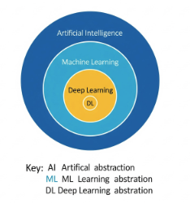
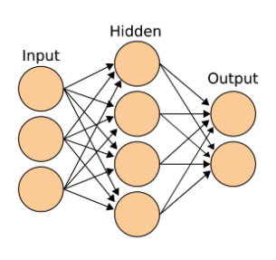
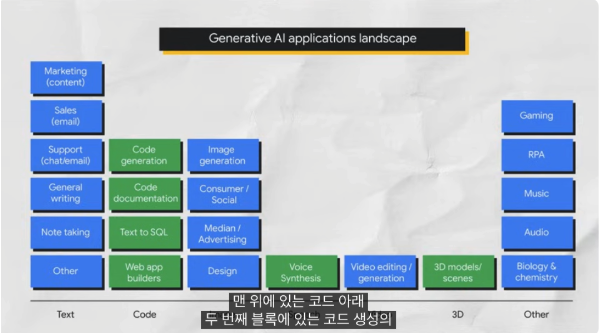

# 01_introduction-to-generative-ai

### **생성형 AI란?**

* **정의:** 텍스트, 이미지, 오디오 등 다양한 콘텐츠를 생성하는 인공지능 기술.  
* **AI의 하위 개념:** AI → 머신러닝 → 딥러닝 → 생성형 AI 순서로 포함되는 개념.

* 

* **AI:** 기계가 사람처럼 생각하고 행동하게 만드는 컴퓨터 과학 분야.  
  * **머신러닝:** 데이터를 학습하여 예측하거나 분류하는 AI의 한 분야.  
    * **지도 학습:** 레이블(정답)이 있는 데이터로 학습하여 미래 값을 예측.  
    * **비지도 학습:** 레이블이 없는 데이터에서 그룹이나 패턴을 발견.  
    * **딥러닝:** 인간 뇌의 신경망을 모방한 인공 신경망을 사용하여 복잡한 패턴을 처리. 준지도 학습(레이블이 일부만 있는 데이터)도 가능.  
* **생성형 AI 위치:** 딥러닝의 한 분야로, 인공 신경망을 사용하고 지도, 비지도, 준지도 학습 방법을 모두 활용하는 모델.

* 

### **생성형 모델과 판별형 모델**

* **판별형 모델:** 데이터를 분류하거나 레이블을 예측하는 데 사용. (예: 사진 속 객체가 '개'인지 분류)  
* **생성형 모델:** 학습된 데이터의 확률 분포를 기반으로 새로운 데이터를 생성. (예: '개'라는 레이블에 맞는 새로운 개 사진을 생성)  
* **생성형 AI 판단 기준:** 출력값이 숫자, 분류, 확률이 아닌 자연어(텍스트), 이미지, 오디오 등의 콘텐츠일 때.

### **생성형 AI의 작동 과정과 주요 개념**

* **과정:** 훈련 데이터(레이블 유무 포함)를 사용하여 '기반 모델(Foundation Model)'을 구축하고, 이 모델이 새로운 콘텐츠를 생성하는 과정.  
* **프롬프트(Prompt):** LLM(대규모 언어 모델)에 주어지는 짧은 텍스트 입력으로, 모델의 출력을 제어하는 수단.  
* **프롬프트 디자인:** 원하는 출력을 얻기 위해 프롬프트를 작성하는 과정.

### **생성형 AI 모델 종류**

* **텍스트-투-텍스트:** 자연어 입력을 받아 텍스트 출력 생성. (예: 언어 번역)  
* **텍스트-투-이미지:** 텍스트 설명으로 이미지 생성.  
* **텍스트-투-비디오 & 텍스트-투-3D:** 텍스트 입력으로 비디오나 3D 개체 생성.  
* **텍스트-투-태스크:** 텍스트 입력에 기반하여 특정 작업 수행. (예: 질문 답변)

### **Foundation Model**

* **정의:** 방대한 양의 데이터로 사전 훈련된 대규모 AI 모델.

* 

* **특징:** 다양한 작업(감정 분석, 이미지 캡션 등)에 미세 조정(Fine-Tuning)을 통해 적용 가능.  
* **주요 모델:** Google의 Gemini와 같은 멀티모달 모델.

### **Google Cloud에서의 생성형 AI 활용**

* **Vertex AI Studio:** 생성형 AI 모델을 빠르게 탐색, 맞춤 설정, 배포할 수 있는 통합 플랫폼.  
* **Vertex AI Agent Builder:** 코딩 경험이 적은 사용자도 챗봇, 디지털 비서 등을 만들 수 있는 도구.  
* **Gemini:** 텍스트, 이미지, 오디오, 코드 등을 이해하고 생성할 수 있는 Google의 멀티모달 AI 모델.

### **프롬프트 엔지니어링 및 LLM 개발**

* **프롬프트 엔지니어링:** 모델의 성능 향상을 위해 도메인 지식을 활용하고 예시를 제공하는 등 프롬프트를 전문적으로 설계하는 과정.  
* **전통적 ML 개발과의 차이:** LLM 개발은 전문가 지식, 훈련 예제, 모델 훈련이 불필요하며 프롬프트 디자인이 핵심.  
* **CoT(Chain-of-thought Reasoning):** 모델이 정답을 도출하는 과정을 먼저 설명하게 하면 정확도가 높아지는 현상.  
* **퓨샷(Few-shot) 학습:** 최소한의 데이터로 모델을 훈련하는 방법.  
* **제로샷(Zero-shot) 학습:** 훈련 과정에서 명시적으로 가르치지 않은 내용을 모델이 인식하는 현상.

### **LLM의 한계: 환각(Hallucination)**

* **정의:** 모델이 사실과 다르거나 엉뚱한 내용을 생성하는 현상.  
* **주요 원인:**  
  * 충분하지 않거나 오염된 데이터로 훈련된 경우.  
  * 충분한 문맥이나 제약 조건을 제공받지 못한 경우.

### **Google의 책임감 있는 AI**

* **원칙:** AI 개발 및 배포 전반에 걸쳐 책임감을 인지하고, 모두를 위한 AI 도구를 개발하여 협력적으로 발전하는 것을 목표.