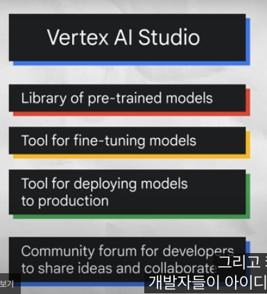
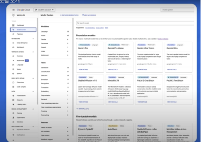

# 02_Introduction to Large Language Models

## 생성형 AI의 정의
텍스트, 이미지, 오디오 등 새로운 콘텐츠를 생성하는 인공지능 유형.  

## LLM(대규모 언어 모델)의 개념
딥러닝의 하위 집합으로, 사전 훈련 후 특정 목적에 맞게 미세 조정 가능한 대규모의 범용 언어 모델.  

* **사전 훈련(Pre-trained) 및 미세 조정(Fine-tuned)** : 일반적인 문제 해결을 위해 대규모 데이터셋으로 사전 훈련하고, 특정 목적에 맞게 더 작은 데이터셋으로 미세 조정하는 과정.  
### LLM의 대규모 의미
방대한 훈련 데이터셋의 크기(페타바이트 규모)와 막대한 파라미터 수(모델이 학습한 지식과 기억).  
### LLM의 범용 의미
인간 언어의 공통성과 제한된 리소스(일부 조직만이 LLM 훈련 가능)로 인해 일반적인 문제 해결에 충분하도록 설계됨.  
### LLM 사용의 이점
  * **다양한 작업에 단일 모델 활용**: 언어 번역, 문장 완성, 텍스트 분류, 질문 답변 등 다양한 작업 수행.  
  * **최소한의 도메인 훈련 데이터 요구**: 적은 양의 도메인 데이터로도 좋은 성능을 보이며, 퓨샷(few-shot) 또는 제로샷(zero-shot) 시나리오에 활용 가능.  
  * **지속적인 성능 향상**: 데이터와 파라미터 추가 시 성능 지속 성장.  

## LLM의 기반 모델
거의 전적으로 트랜스포머 모델에 기반. (인코더와 디코더로 구성)  

* **AI 발전의 흐름**: 전통적인 프로그래밍 → 신경망 → 생성형 모델로의 발전. 

* **생성형 모델의 특징**: 사용자가 텍스트, 이미지, 오디오, 비디오 등 자체 콘텐츠를 생성할 수 있음.  

* **LLM 개발과 전통적인 ML 개발의 차이**:  
  * **LLM 개발**: 전문가 지식 불필요, 훈련 예제 불필요, 모델 훈련 불필요, 프롬프트 디자인이 중요.  
  * **전통적인 ML 개발**: 전문 지식, 훈련 예제, 컴퓨팅 시간, 하드웨어 필요.  
### 프롬프트 디자인 및 프롬프트 엔지니어링
  * **프롬프트 디자인**: 특정 작업에 맞게 명확하고 간결하며 유익한 프롬프트를 생성하는 과정.  
  * **프롬프트 엔지니어링**: 성능 향상을 목표로 도메인 지식 활용, 출력 예시 제공, 키워드 사용 등을 통해 프롬프트를 생성하는 과정. (더 전문화된 개념)  
### LLM의 세 가지 종류
  * **일반 언어 모델(Generic Language Models)**: 훈련 데이터의 언어를 기반으로 다음 단어를 예측. (자동 완성 기능과 유사)  
  * **지시 튜닝 모델(Instruction-tuned Models)**: 입력으로 주어진 지시에 대한 응답을 예측하도록 훈련. (텍스트 요약, 시 생성 등)  
  * **대화 튜닝 모델(Dialog-tuned Models)**: 다음 응답을 통해 대화를 진행하도록 훈련. (챗봇의 질문-답변과 같은 대화 상황에 적합)  
### CoT(Chain-of-thought Reasoning)   
> 모델이 정답을 설명하는 텍스트를 먼저 출력할 때 정답을 더 잘 맞히는 현상  
> 예: "로저에게 테니스공이 몇 개 있는가?"라는 질문에 모델이 답을 바로 내기보다 계산 과정을 보여주면서 답을 찾는 방식  
* **퓨샷(Few-shot) 학습:** 최소한의 데이터로 모델을 훈련하는 것을 의미.  
* **제로샷(Zero-shot) 학습**: 훈련 과정에서 명시적으로 가르치지 않은 것을 모델이 인식할 수 있음을 의미.  
* **파운데이션 모델의 실제 한계 및 해결책**: 모든 작업을 수행하는 모델은 실용적 한계가 있으므로, **작업별 튜닝**을 통해 LLM의 신뢰성 향상.

|  | 비유 설명 |  | 문제점 |
| :---: | ----- | ----- | ----- |
| **Foundation-model** | \- 마치 만능 요리사 같음 \- 어떤 요리든 기본적으로 할 줄 아는 아주 똑똑한 요리사 |  | \- 모든 요리를 최고로 잘할 수는 없음 |
| **Model \-tuning** | \- 만능 요리사를 **특정 분야의 전문 요리사로 만드는 것** \- Foundation-model에게 **새로운 요리 레시피를 가르쳐서** 특정 요리를 더 잘하게 만드는 과정 |  | \- 새로운 데이터셋 준비 및 학습 과정에 **비용과 시간이 많이 소요**됨 \- 돈, 시간이 많이 들어감 \- 새로운 레시피 구하고, 요리 재료 구하고, 실제 여러 번 만드는 훈련 필요 |
| **Fine \-tuning** | \- 요리사(LLM)의 **모든 요리기술과 습관(가중치)를 새로 배우고 고치는 것** \- **마치 요리 학교를 새로 다니는 것과 같음** |  | \- 대규모 컴퓨팅 **자원**(GPU 등)과 **시간**, 자체 모델 호스팅 **비용 등 많이 발생** \-요리의 모든 기술을 바꾸고, 새로운 주방(대규모 훈련 장비) 필요                          → 현실적으로 어려움 |
| **PETM** (Parameter Efficient Tuning Methods) | \- 요리사가 모든 기술을 바꾸는 대신, 특정 요리에 **필요한 양념**이나 **도구만 추가**해서 맛을 내는 것과 유사 \- **Foundation-model**(기본 요리사)은 그대로 두고, **아주 적은 수의 레이어**(양념, 도구)만 **추가**해서 특정 요리를 더 잘하게 만드는 것  \- 요리가 끝나면 추가된 양념, 도구만 제거하면 되니 요리사(LLM)는 변하지 않고 비용도 적게 발생 **(= 효율성이 높음)** |  | \- **아직은 미세조정만큼 최적의 성능을 보장하지 못할 수 있음** \- **특정 복잡한 작업**에서는 **여전히 한계**가 있을 수 있음 \- 돈과 시간은 아껴줄 수 있지만 정말 최고의 맛을 내지는 못하는 것과 같음 |

  * **모델 튜닝(Model-tuning)**:   
    * 모델이 수행하려는 작업 예시를 기반으로 모델 응답을 사용자 지정하는 과정. 새로운 데이터로 모델을 훈련하여 새로운 도메인 또는 사용자 지정 사용 사례에 모델을 적용하는 과정.  
    * 예시: 법률 또는 의료 분야에 특화된 모델 튜닝.  
  
  * **미세 조정(Fine-tuning)**
    * 자체 데이터셋을 가져와서 LLM의 모든 가중치를 튜닝하여 모델을 재훈련하는 방법.   
    * 이는 대규모 훈련 작업과 자체 미세 조정 모델 호스팅이 필요하므로 비용이 많이 들고 현실적이지 않을 수 있음.  
  
  * **PETM(Parameter-Efficient Tuning Methods)**:   
    * 모델을 복제하지 않고도 사용자 지정 데이터로 LLM을 튜닝하는 효율적인 방법.   
    * 기본 모델은 변경되지 않으며, 적은 수의 추가 레이어만 튜닝되어 추론 시 교체 가능  
  
## Google Cloud의 LLM 활용 도구
### Vertex AI Studio
  * 생성형 AI 모델 탐색 및 맞춤 설정  
  * 사전 훈련된 모델 라이브러리, 미세 조정 및 배포 도구 제공
  * 
			

### Vertex AI Agent Builder** *(구 Vertex AI Search and Conversation)*
코딩 경험이 적어도 고객 및 직원을 위한 생성형 AI 검색 및 대화 기능(챗봇, 디지털 비서 등) 구축 지원  

### Gemini  
  * 구글의 멀티모달 AI 모델  
  * 텍스트뿐만 아니라 이미지, 오디오, 프로그래밍 코드까지 이해  
  * 다양한 애플리케이션에 적용 가능  
  * **Model Garden**: 새로운 모델을 지속적으로 업데이트
  *  