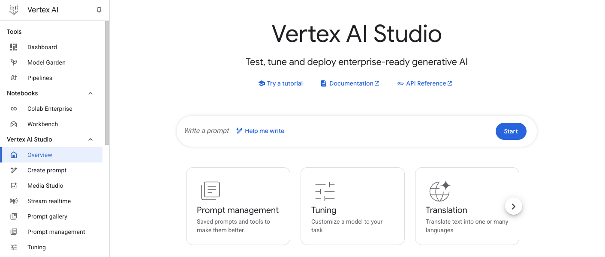
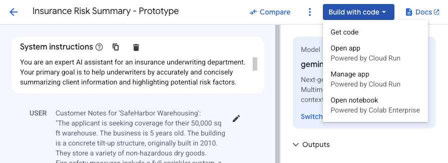

### **Vertex AI Studio 시작하기**

* **실험 개요:**
    * 예측 및 생성형 AI 기능을 모두 제공하는 포괄적인 머신러닝 개발 플랫폼인 **Vertex AI**에 대한 소개.
    * **Vertex AI Studio**를 통해 Gemini와 같은 최신 생성형 AI 모델의 잠재력을 활용할 수 있으며, 특히 보험회사를 위한 위험 분석 보조 도구 프로토타입을 제작하는 역할 학습.
    * 프롬프트 아이디어를 배포 가능한 애플리케이션으로 전환하고, 정교한 프롬프트 설계로 특정 결과물을 얻으며, 이미지를 포함한 다양한 데이터를 분석하는 **멀티모달** 기능 사용 학습.
    * 이러한 핵심 작업에는 **API**나 Python **SDK**가 필요하지 않음.

* **목표:**
    * 프롬프트에서 애플리케이션을 생성.
    * 효과적인 프롬프트 설계.
    * 프롬프트 엔지니어링 및 관리.
    * 멀티모달 프롬프트 사용.

* **준비 및 요구사항:**
    * 랩 시작 전 지침 숙지 및 **Start Lab** 버튼 클릭.
    * 실제 클라우드 환경에서 실습 진행.
    * 랩을 위한 임시 자격 증명(credentials)을 사용하여 **Google Cloud**에 로그인.
    * **Chrome** 브라우저의 시크릿(Incognito) 또는 프라이빗(private) 창 사용 권장.
    * 랩 완료에 소요되는 시간 기억.
    * 랩에서 제공된 학생 계정만 사용해야 함.
    * 랩 시작 버튼 클릭 후 **Open Google Cloud console**을 통해 로그인 및 **Google Cloud console** 접속.

---

### **Task 1. 프롬프트로 애플리케이션 생성**

* **개요:**
    * **Vertex AI Studio**를 사용하여 생성형 AI 보조 도구 아이디어를 작동하는 프로토타입으로 신속하게 전환하는 방법 학습.
    * 보험 시나리오에 맞춰 위험 분석 보고서 작성을 돕는 프롬프트 생성 후, 이를 간단한 애플리케이션으로 준비하는 과정.

* **세부 절차:**
    * **Google Cloud console**의 **Navigation menu**에서 **Vertex AI > Vertex AI Studio > Overview**를 선택.
      * 
    * **Vertex AI** 메뉴 아래 **Vertex AI Studio**에서 **Create prompt**를 선택.
      * 
    * 새 프롬프트 페이지에서 좌측 상단의 **Untitled Prompt**를 클릭하여 프롬프트 이름을 **Insurance Risk Summary - Prototype**으로 변경.
    * **System Instructions**에 보험 시나리오와 관련된 역할을 부여하는 지침 입력.
    * 메인 프롬프트 영역에 고객 노트와 작업 지침을 포함한 프롬프트 내용 붙여넣기.
        ```python
        
        # 보험 시나리오: 
        You are an expert AI assistant for an insurance underwriting department.
        Your primary goal is to help underwriters by accurately and concisely summarizing client information and highlighting potential risk factors.
        Maintain a professional and objective tone.
        Focus only on the information provided in the prompt. Do not invent details.

        # 고객 메모:
        Customer Notes for 'SafeHarbor Warehousing':
        "The applicant is seeking coverage for their 50,000 sq ft warehouse. The business is 5 years old. The building is a concrete tilt-up structure, originally built in 2010. They store a variety of non-hazardous dry goods.
        Fire safety measures include a full sprinkler system, a centrally monitored fire alarm, and documented annual inspections by a certified third party.
        Security measures include a 24/7 centrally monitored burglar alarm, comprehensive security camera coverage of the interior and exterior, a fully fenced perimeter, and nightly patrols by a contracted security guard service.
        The company reports no major property or liability losses in their 5-year history. They have specifically asked to ensure their new automated shelving and retrieval system, installed last month, is adequately covered under the policy."

        Your Task:
        1. Briefly summarize the key details of the 'SafeHarbor Warehousing' business and its existing safety measures.
        2. Based *only* on the notes provided, identify any immediate questions an underwriter should ask or potential risk factors they should consider further.
        Present the summary first, then the questions/risk factors as bullet points.

        ```
    * 우측 **Configuration** 섹션에서 모델 및 **Region** 등 설정 확인.
    * **Submit** 버튼을 클릭하여 모델의 응답 확인.
    * 상단의 **Save** 버튼을 클릭하여 프롬프트 저장.
    * 상단 우측의 **Build with code** 버튼을 클릭하고, 드롭다운 메뉴에서 **Deploy as app (Powered by Cloud Run)**을 선택.
      * 
    * 필요한 경우 **Cloud Build API**, **Cloud Run API** 등 서비스 활성화.
      * **Acknowledgement**를 확인하고 **Create App**을 클릭.
    * 배포가 완료되면, 다시 **Build with code** 버튼을 클릭하고 **Open app (Powered by Cloud Run)**을 선택하여 배포된 애플리케이션 확인.
      * 
    * 새 브라우저 탭에서 열린 **Vertex AI GenAI App**에 새로운 테스트 메시지를 입력하여 배포된 앱의 작동 방식 확인.
      * 
      * 
    * 이 과정을 통해 **Vertex AI Studio**에서 프롬프트를 설계하고, 이를 **Cloud Run**을 사용해 서버리스 애플리케이션으로 배포하는 신속한 프로토타입 제작 주기 완료.
        * 
        * 
        * 
      * 챗봇 섹션 메시지에 새 메시지 테스트 
      ```python
        New Customer Inquiry:
        "Applicant 'Coastal Goods Delivery' has a fleet of 10 delivery vans, all equipped with GPS and telematics. They operate within a 100-mile radius of their depot. Drivers undergo annual safety training. They had one minor fender bender last year, no injuries, $1500 damages. What are the primary risk considerations?"

        Please summarize key points and identify potential risks.
      ```
---

### **Task 2. 효과적인 프롬프트 설계**

* **개요:**
    * **Vertex AI Studio**에서 프롬프트 엔지니어링의 핵심 기술인 프롬프트 정제(refining) 방법을 깊이 탐구.
    * 정밀하고 제어된 출력물을 얻기 위해 다양한 프롬프트 기법 시도.

* **Zero-shot prompting:**
    * 새로운 프롬프트인 **Insurance Claim Data Extraction** 생성.
    * **System instructions**에 보험 청구 데이터 추출을 위한 **AI** 보조 역할 지침 입력.
    ```python
    You are an AI assistant specializing in parsing and extracting specific data points from unstructured insurance claim notifications.
    Your goal is to identify and list key information accurately.
    If a piece of information is not found, clearly state "Not found".
    Output the extracted information in a key: value format, with each key on a new line.
    ```
    * 메인 프롬프트 영역에 비정형 청구 노트와 추출할 항목 목록을 포함한 프롬프트 붙여넣기.
    ```python
    Claim Notification Received:
    "Hi team, just got a call from Mrs. Eleanor Vance, policy #POL458892. She reported a kitchen fire that occurred on May 12th, 2025, around 3 PM. The main damage seems to be to the oven and surrounding cabinets. She mentioned smoke damage in the kitchen and dining area too. She thinks the total damage might be around $7,500. Her contact is 555-0123. No injuries reported, thankfully."

    Extract the following:
    - Policy Number
    - Claimant Name
    - Date of Loss
    - Time of Loss
    - Type of Loss
    - Brief Description of Damage
    - Estimated Loss Amount
    - Injuries Reported
    ```
      * 
    * **Configuration**에서 **`Temperature`**를 `0.1`로, **`Output token limit`**을 `1024`로 설정 후 **Submit**하여 모델의 응답 확인.
    * **zero-shot prompting**(명시적 예시 없이 모델에 지침을 제공하는 방식) 결과 검토.

* **Few-shot prompting:**
    * 명확한 예시를 제공하여 모델 성능을 개선하는 **few-shot prompting** 학습.
    * **Prompt** 섹션의 **Add Examples** 버튼을 클릭하여 새로운 창에서 예시 추가.
      * 
    * 첫 번째 예시의 **INPUT**에 비정형 노트, **OUTPUT**에 완벽하게 형식화된 추출 결과 붙여넣기.
    ```python
    # INPUT
    Claim Notification Received:
    "Email from John Sterling (policy POL77521) re: water damage at his shop. Happened sometime last night, May 10th, 2025. A pipe burst in the ceiling. Stockroom is flooded, some damage to inventory. He's not sure on the cost yet, maybe $5k-$10k? No one was there, so no injuries."

    Extract the following:
    - Policy Number
    - Claimant Name
    - Date of Loss
    - Time of Loss
    - Type of Loss
    - Brief Description of Damage
    - Estimated Loss Amount
    - Injuries Reported

    # OUTPUT
    Policy Number: POL77521
    Claimant Name: John Sterling
    Date of Loss: May 10th, 2025
    Time of Loss: Night
    Type of Loss: Water damage
    Brief Description of Damage: Pipe burst in ceiling, stockroom flooded, some damage to inventory.
    Estimated Loss Amount: $5,000 - $10,000
    Injuries Reported: No
    ```
      * 
    * 프롬프트가 지워진 경우 **System instructions**를 다시 붙여넣고, **(Input)** 필드에 원본 청구 노트, **Write your prompt here** 필드에 추출 지침 입력.
    * **Submit**하여 **zero-shot** 시도와 비교하며 정확도 및 서식 개선 여부 확인.
    ```python
    # Re-add System Instructions

    You are an AI assistant specializing in parsing and extracting specific data points from unstructured insurance claim notifications.
    Your goal is to identify and list key information accurately.
    If a piece of information is not found, clearly state "Not found".
    Output the extracted information in a key: value format, with each key on a new line.

    # New INPUT Prompt

    Claim Notification Received:
    "Hi team, just got a call from Mrs. Eleanor Vance, policy #POL458892. She reported a kitchen fire that occurred on May 12th, 2025, around 3 PM. The main damage seems to be to the oven and surrounding cabinets. She mentioned smoke damage in the kitchen and dining area too. She thinks the total damage might be around $7,500. Her contact is 555-0123. No injuries reported, thankfully."

    # Instruction guide
    Extract the following data points from the provided claim notification:
    - Policy Number
    - Claimant Name
    - Date of Loss
    - Time of Loss
    - Type of Loss
    - Brief Description of Damage
    - Estimated Loss Amount
    - Injuries Reported
    ```
    
    * 


* **프롬프트 구성 실험:**
    * **Configuration** 패널의 다양한 매개변수가 모델 응답에 미치는 영향 탐색.
    * **Temperature**(무작위성 제어): 0.1에서 0.7로 변경하며 출력의 변화 관찰.
      * 
      * 
      * 
  
    * **Output Token Limit**(최대 토큰 수): 매우 작은 값(예: 20)으로 설정하여 출력이 잘리는지 확인.
    * **Top-P**(nucleus sampling): 0.8과 1.0으로 변경하며 출력의 미묘한 차이 관찰.
    * **Safety Filter Settings**는 기본 설정 사용.
      * 

---

### **Task 3. 프롬프트 엔지니어링 및 관리**

* **개요:**
    * 프롬프트의 변경 사항을 실험하고 응답을 개선하기 위해 **Vertex AI Studio**의 "Compare" 기능을 사용하는 방법 학습.
    ```python
    # SYSTEM Instruction box
    You are an insurance risk analyst assistant. Your task is to identify potential risk factors from a given scenario. Be concise.

    # main prompt
    Scenario:
    "The applicant, 'The Fiery Grill,' is a new upscale restaurant specializing in wood-fired oven pizzas and open-flame grilling. They have installed a brand new, custom-built fire suppression system for their cooking area, but it has not yet been certified by a third party. The restaurant plans to feature live acoustic music on weekend evenings and has a small, raised stage area. They also want to offer valet parking."

    Based on this scenario, list three primary risk factors an underwriter should consider.
    ```
    * 

* **비교를 위한 프롬프트 설정:**
    * 새 프롬프트인 **Comparison Base - Restaurant Risks** 생성.
    * **System instructions**에 보험 위험 분석가 보조 역할 입력.
    * 메인 프롬프트 영역에 "The Fiery Grill" 시나리오와 주요 위험 요인 목록 요청 프롬프트 입력.
    ```python
    You are an expert insurance risk analyst assistant. Your task is to identify potential risk factors from a given scenario. For each risk factor, also briefly suggest a potential mitigation strategy or question for the underwriter. Be clear and structured.

    Scenario:
    "The applicant, 'The Fiery Grill,' is a new upscale restaurant specializing in wood-fired oven pizzas and open-flame grilling. They have installed a brand new, custom-built fire suppression system for their cooking area, but it has not yet been certified by a third party. The restaurant plans to feature live acoustic music on weekend evenings and has a small, raised stage area. They also want to offer valet parking."

    Based on this scenario, list three primary risk factors an underwriter should consider.
    ```
      * 모델 = 첫번째와 똑같이 설정
      * 온도 = 0.2
    * **Configuration**에서 **Temperature**를 0.2로 설정하고 **Submit** 및 저장.

* **프롬프트 지침 수정을 통한 비교:**
    * **Compare** 버튼을 클릭하여 비교 인터페이스 열기.
    ```python
    Scenario:
    "The applicant, 'The Fiery Grill,' is a new upscale restaurant specializing in wood-fired oven pizzas and open-flame grilling. They have installed a brand new, custom-built fire suppression system for their cooking area, but it has not yet been certified by a third party. The restaurant plans to feature live acoustic music on weekend evenings and has a small, raised stage area. They also want to offer valet parking."

    Based on this scenario, list three primary risk factors an underwriter should consider.
    ```
    * **+ Compare new prompt**를 클릭하여 새로운 프롬프트 편집 창 열기.
    * 새 창에 지침이 추가된 프롬프트와 시나리오를 결합하여 붙여넣기.
    * **Submit prompts**를 클릭하고, 수정된 지침으로 인해 응답에 완화 전략이나 질문이 포함되는지 확인.
    * **Save as new**를 클릭하여 새 프롬프트로 저장.
    * 


* **다른 Temperature 설정을 통한 비교:**
    * 두 번째 프롬프트 창의 텍스트를 원래 버전으로 되돌림.
    * 두 번째 프롬프트 창의 **Configuration**에서 **Temperature**를 2.0으로 변경 후 **Submit prompts**를 클릭.
    * 높은 **Temperature** 값이 덜 집중적이거나 추측성 응답을 유발하는지 비교 관찰.

* **다른 모델 및 구성을 통한 비교:**
    * 두 번째 프롬프트 창의 텍스트는 동일하게 유지.
    * **Configuration**에서 **Model**을 다른 모델로 변경하고, **Output token limit**을 65535로 설정.
    * **Submit prompts**를 클릭하고, 다른 모델 간의 응답, 추론 방식, 출력 스타일 차이점 비교.

* **프롬프트 관리:**
    * 실험 내용을 정리하고 효과적인 프롬프트를 재사용하기 위해 **Prompt Management** 활용.
    * 프롬프트를 저장하면 기본적으로 **Autosave** 기능이 활성화됨.
    * **Navigation menu**에서 **Vertex AI > Vertex AI Studio > Prompt Management**로 이동하여 저장된 프롬프트 목록 확인.
    * 이 페이지에서 프롬프트 조회, 삭제, 내보내기 및 최적화 도구 접근 가능.

---

### **Task 4. Gemini를 사용한 멀티모달 프롬프트 활용**

* **개요:**
    * **Vertex AI Studio**의 메인 프롬프트 인터페이스에서 **Gemini** 모델을 사용하여 이미지를 분석하고 정보를 추출하는 방법 학습.
    * 시각적 콘텐츠를 기반으로 이미지 설명, 텍스트 추출, 질의응답과 같은 다양한 분석 작업에 대한 프롬프트 설계 방법 시연.

* **세부 절차:**
    * **Google Cloud console**에서 **Vertex AI > Vertex AI Studio > Create prompt**를 선택.
    * 프롬프트 이름을 **Timetable Image Analysis**로 변경.
    * 우측 **Configuration** 패널에서 모델 및 **Region** 설정 확인.
    * 제공된 시간표 이미지를 로컬에 다운로드.
      * 
    * **Prompt** 섹션에서 **Insert Media** 버튼을 클릭하여 다운로드한 이미지 파일을 업로드.
    * 이미지 아래에 텍스트 프롬프트로 이미지에 대한 제목, 설명, 가시적 텍스트 추출(시간표 형식화)을 요청.
    ```python
    # IMAGE INPUT FIELD
    1. Provide a concise title for this image (under 5 words).
    1. Describe the image in one or two sentences.
    2. Extract all visible text from the image. Present the flight schedule as a clearly formatted list with columns for "Time" and "City".

    # TEXT PROMPT FIELD
    Based on the flight schedule shown in the image, what percentage of the listed flights depart before 11:30 AM? Show your calculation if possible.
    ```
    * **Submit** 버튼을 클릭하여 모델의 응답 확인.
      * 
    * 텍스트 프롬프트를 "이미지에 표시된 비행 일정 중 11:30 AM 이전에 출발하는 비행편은 몇 퍼센트인가?"로 변경하고 **Submit**하여 모델의 추론 능력 확인.
      * 
    * **Configuration**에서 **Temperature** 값을 0.8로 변경하여 동일한 프롬프트로 다시 시도하며 응답 스타일의 변화 관찰.
    * 탐색 완료 후, 프롬프트를 저장.

---

### **Task 5. Vertex AI Media Studio 탐색**

* **개요:**
    * 텍스트 프롬프트를 사용하거나 기존 미디어를 다듬어 다양한 미디어 유형을 직접 생성하는 **Vertex AI Studio**의 강력한 도구들을 탐색.
      * 
    * 이미지, 비디오, 음성 생성 기능 학습.

* **Imagen을 사용한 이미지 생성:**
    * **Vertex AI Studio > Media Studio**로 이동.
    * "Start with a text prompt" 섹션 아래에서 **Imagen - Generate images**를 클릭.
      * 
    * 하단의 텍스트 프롬프트 영역에 "생동감 넘치는 보라색 라벤더 꽃에서 꽃가루를 모으는 한 마리의 꿀벌을 근접 촬영한 사진 같은 이미지"와 같이 이미지 설명을 입력.
    ```python
    A close-up, photorealistic image of a single honeybee collecting pollen from a vibrant purple lavender flower, with a softly blurred garden background.
    ```
    * 우측 **Settings** 패널에서 **Model**을 **Imagen 4**로 설정, **Aspect ratio**를 1:1로, **Number of results**를 4로 설정.
    * **Submit** 버튼을 클릭하여 생성된 이미지 확인.
      * 
    * 생성된 이미지 썸네일을 클릭하여 세부 보기에서 **Inpaint**, **Outpaint** 등 **AI actions** 기능 탐색.
      * 
      * 
      * 
      * 
    * **SynthID detected**(SynthID 감지됨) 표시를 통해 AI 생성 이미지에 워터마크가 삽입되었음을 확인.
    * **SynthID**: AI 생성 이미지의 픽셀에 육안으로 인식할 수 없는 디지털 워터마크를 삽입하는 기술로, 이미지의 투명성 및 책임 있는 **AI** 활용을 증진함.

* **Chirp를 사용한 음성 생성 (선택 사항):**
    * 좌측 세로 도구 모음에서 마이크 모양의 **Audio** 아이콘을 클릭하여 음성 생성 도구로 전환.
    * 필요한 경우 **Cloud Text-to-Speech API** 활성화.
    * 하단 텍스트 프롬프트 영역에 합성하고자 하는 텍스트 입력.
    ```python
    Welcome to the world of generative AI on Google Cloud
    ```
    * 우측 **Settings** 패널에서 **Model**, **Language**, **Voice**를 선택.
    * **Submit** 버튼을 클릭하여 생성된 오디오 재생.

* **결론 및 다음 단계:**
    * **Vertex AI Studio**를 통해 생성형 **AI** 애플리케이션 프로토타입 제작, 고급 프롬프트 엔지니어링 및 비교, 이미지 및 음성 생성과 같은 멀티모달 기능 탐색 완료.
    * 다음 단계로 **Vertex AI Model Garden** 문서, **Prompt design strategies guide**, **Vertex AI SDKs** 문서 등을 통해 추가 학습 권장.