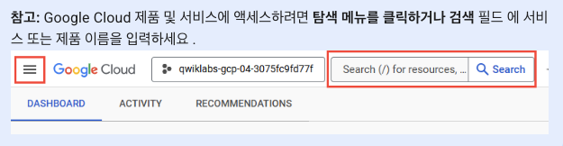
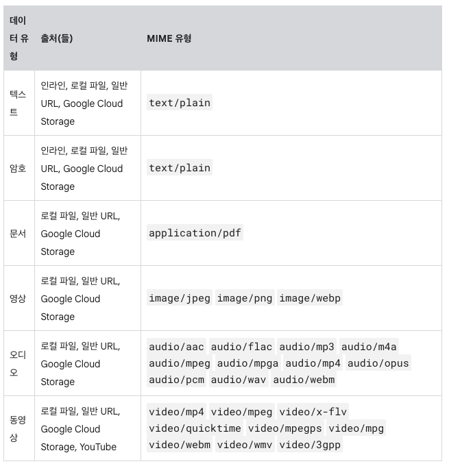

## Lab_01. Gemini 2.0 Flash 소개

> 이 랩은 **Vertex AI**의 **Gemini API**를 통해 제공되는 **Gemini 2.0 Flash** 모델을 소개하는 과정.
> 
> 향상된 속도, 성능, 품질을 갖춘 **Gemini 2.0 Flash** 모델의 다양한 기능과 활용법 학습.

### 주요 내용

* **[Gemini](https://deepmind.google/models/gemini/)**: 텍스트, 코드, 이미지, 오디오, 비디오 등 다양한 콘텐츠를 이해하고 생성하는 **Google DeepMind**의 강력한 **생성형 AI** 모델 제품군.  
* **[Vertex AI의 Gemini API](https://cloud.google.com/vertex-ai/generative-ai/docs/learn/models?hl=ko\#gemini-models)**: 개발자가 **Gemini** 모델을 애플리케이션에 쉽게 통합할 수 있도록 통합된 인터페이스 제공. 최신 정보는 **Gemini** 공식 문서를 참고.  
* **Gemini 모델 종류**  
  * **[Gemini Pro](https://deepmind.google/models/gemini/pro/)**: 복잡한 추론에 최적화된 모델 (방대한 정보 분석/요약, 복잡한 코드 문제 해결 등).  
  * **[Gemini Flash](https://deepmind.google/models/gemini/flash/)**: 속도와 효율성에 최적화된 모델 (초고속 응답, 저비용, 향상된 **Multimodal** 기능).

#### **선수 조건**

* 기본적인 Python 프로그래밍 지식  
* 일반적인 API 개념 이해  
* **[Vertex AI Workbench](https://cloud.google.com/vertex-ai/docs/workbench/introduction?hl=ko)** 에서 Jupyter 노트북 실행 경험

#### **학습 목표**

* **텍스트 및 코드 생성**: 다양한 형식의 텍스트와 코드 생성, 스트리밍 출력, 다중 턴 대화 기능.  
* **모델 동작 구성 및 제어**: 모델 매개변수 설정, 시스템 지침, 안전 필터 적용, 제어된 생성 기술 활용.  
* **Multimodal 데이터 처리**: 텍스트, 오디오, 코드, 문서, 이미지, 비디오 등 다양한 데이터 유형 처리.  
* **모델과의 유연한 상호 작용**: 동기 및 비동기 상호 작용 방법 활용.  
* **Google 검색을 활용한 모델 응답의 근거 확보 (Grounding)**: **Google 검색** 결과를 바탕으로 모델 응답의 정확성과 최신성 향상.  
* **함수 호출 및 토큰 관리**: 자동/수동 함수 호출 구현 및 토큰 수 계산 방법 학습.

#### **설정 및 요구 사항**

* **`실습 시작`** : → `Google Cloud 콘솔` 열기 (**`시크릿창`**)
* 필요한 경우 **사용자 이름 복사 및 붙여 넣기**:   
  ```python  
    "Username"  
  ```
* **비밀번호 복사 복사 및 붙여넣기 :**   
  ```python  
    "Password"  
  ```
* `Google Cloud 콘솔` 탭 열림
  * 

### **실습 세부 내용**

* **Task 1**: `Vertex AI Workbench`에서 노트북 열기  
  * `Google Cloud 콘솔`의 탐색 메뉴 `(≡)` → `Vertex AI` → `Workbench` 클릭  
  * `워크벤치 인스턴스 이름` → 인스턴스 열기 → `JupyterLab` 열기  
* **Task 2**: 노트북 설정
  * `노트북 이름` → 커널 선택에서 `Python 3` 선택  
  * 노트북의 시작하기 및 라이브러리 가져오기 섹션: `프로젝트 ID`, `Region` 설정
* **Task 3**: 텍스트 프롬프트로 텍스트 생성
  * **Gemini 2.0 Flash** 모델 로드.  
  * 텍스트 프롬프트에 대한 텍스트 응답 생성.  
  * `generate\_content\_stream\` 메서드를 사용한 콘텐츠 스트림 생성.  
  * **멀티 턴** 채팅 시작.  
  * **비동기 요청**전송.  
    * [`비동기 client 메서드`](https://docs.python.org/3/library/asyncio.html)

		```python

		client.models.generate_content

		```

* **Task 4**: 모델 매개변수 구성
  * [모델 매개변수](https://cloud.google.com/vertex-ai/generative-ai/docs/learn/prompts/adjust-parameter-values?hl=ko) 설정.  
    * [모든 Gemini API 매개변수](https://cloud.google.com/vertex-ai/generative-ai/docs/model-reference/inference?hl=ko\#parameters) 목록 확인하기  
    * 노트북의 **모델 매개변수 구성** 섹션 실행하기  
  * [시스템 지침](https://cloud.google.com/vertex-ai/generative-ai/docs/learn/prompts/system-instruction-introduction?hl=ko) 설정.  
    * 노트북의 **시스템 지침 설정** 섹션 실행하기  
  * [안전 필터 구성]([https://cloud.google.com/vertex-ai/generative-ai/docs/multimodal/configure-safety-filters?hl=ko](https://cloud.google.com/vertex-ai/generative-ai/docs/multimodal/configure-safety-filters?hl=ko))  
    * 기본 설정 = `OFF`  
    * 기본 차단 임계값 = `BLOCK_NONE`  
    * 각 요청에 대한 보안 설정을 조정하는 데 사용할 수 있음  
    * `BLOCK_LOW_AND_ABOVE`  
         
* **Task 5**: `Multimodal 프롬프트` 전송
* 


* **로컬 이미지** 전송 섹션 실행  
  * **`Google Cloud Storage`의 문서 보내기** 섹션 실행  
  * **일반 `URL의 오디오` 보내기** 섹션 실행  
  * **`YouTube URL`의 비디오 보내기** 섹션 실행  

* **Task 6**: [`생성된 출력 제어 및 토큰 관리`]([https://cloud.google.com/vertex-ai/generative-ai/docs/multimodal/control-generated-output?hl=ko](https://cloud.google.com/vertex-ai/generative-ai/docs/multimodal/control-generated-output?hl=ko))

  * **응답 스키마 정의** = **모델 출력 구조, 필드 이름, 각 필드에 필요한 데이터 유형 지정**  
    * `response_schema` = 매개변수  
    * `config` = 모델 출력 엄격히 따르게 함  
  * 스키마 제공 형태 : `Pedantic`, `JSON`, `Enum` `response_mime_type`등  
  * [토큰 계산](https://cloud.google.com/vertex-ai/generative-ai/docs/multimodal/list-token?hl=ko)  
    * `count_tokens()` 메서드   
  
* **Task 7**: `Google 검색 도구 활용` [Grounding](https://cloud.google.com/vertex-ai/generative-ai/docs/multimodal/list-token?hl=ko)
  * **Google 검색**을 활용하여 모델 응답에 실제 데이터 근거 확보. 
  * 모델 응답의 정확도와 최신성 향상 가능  
    * `Gemini-2.0`부터 가능  
  * 구글 검색  
    * [그라운딩]([https://cloud.google.com/vertex-ai/generative-ai/docs/grounding/overview?hl=ko\#dynamic-retrieval](https://cloud.google.com/vertex-ai/generative-ai/docs/grounding/overview?hl=ko#dynamic-retrieval))  
    * `tools` 키워드 인수를 `Tool`에 포함시켜 `GoogleSearch Gemini`가 **먼저** 해당 프롬프트를 사용해 **구글 검색을 수행 다음** 웹 검색 결과에 따라 답변 구성하도록 지시  
  
* **Task 8**: 함수 호출 및 코드 실행
  * [Python 함수를 활용한 자동 함수 호출](https://cloud.google.com/vertex-ai/docs/generative-ai/multimodal/function-calling)  
  * **[OpenAPI Specification](https://www.openapis.org/)** 을 활용한 수동 함수 호출.  
    * 노트북의  **`Python\`** 함수 (자동 함수 호출) 섹션 실행  
    * 노트북의 **`Open API\`** 함수 (수동 함수 호출) 섹션 실행  
  * [코드 실행](https://ai.google.dev/gemini-api/docs/code-execution?lang=python) 기능.